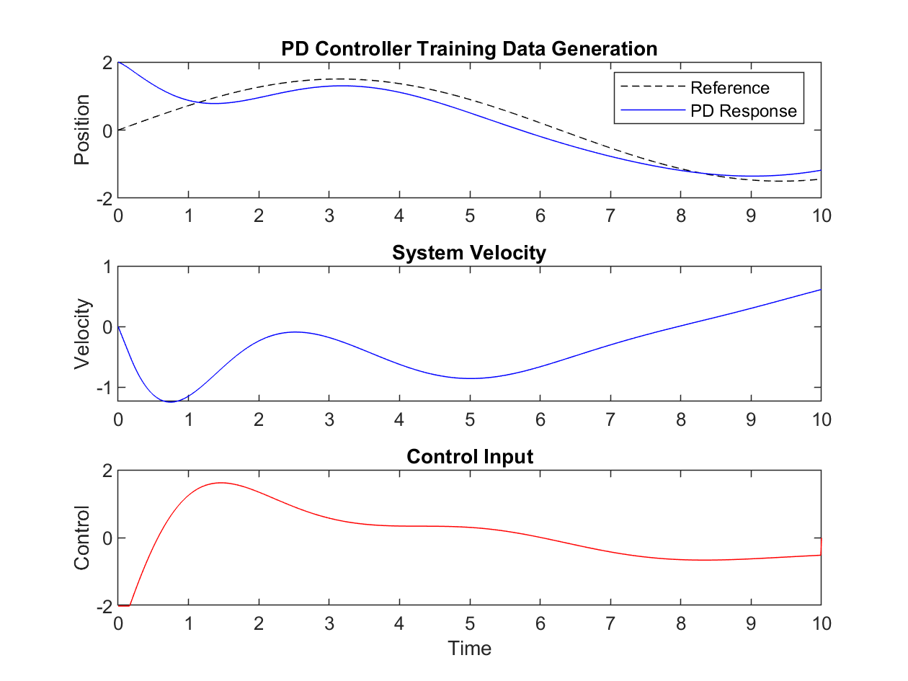
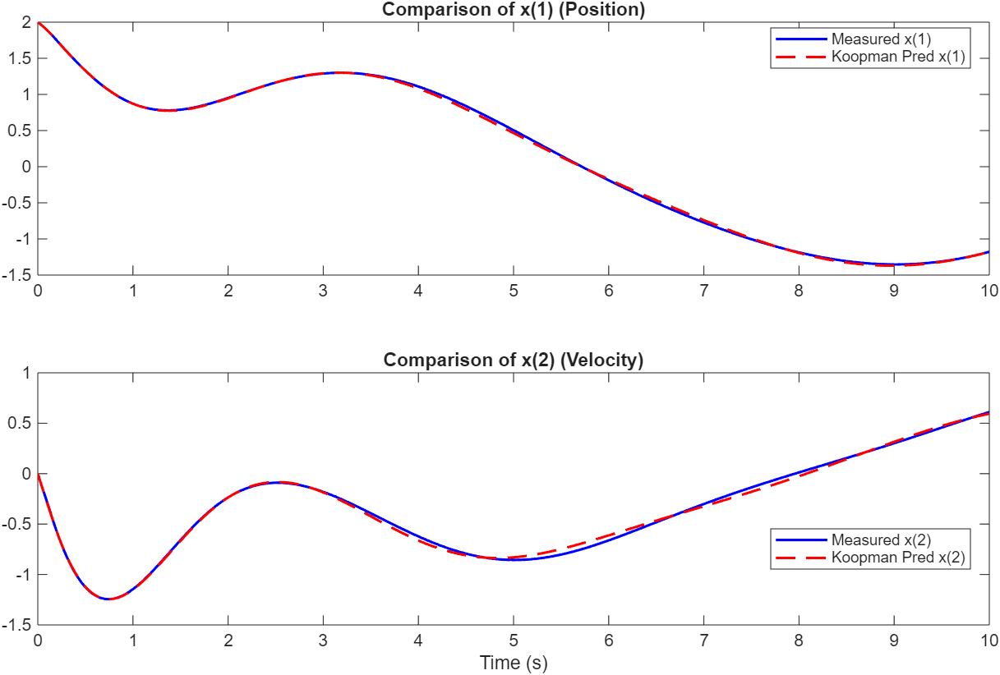
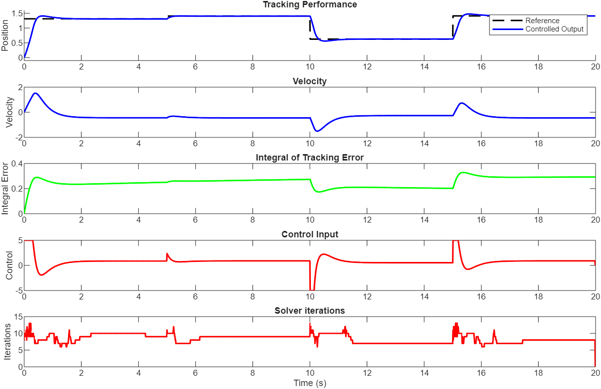
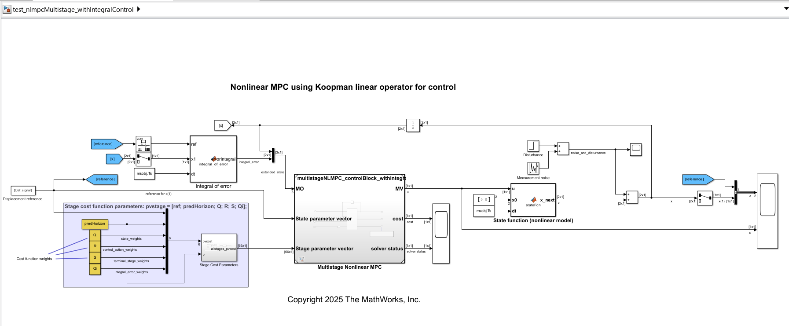
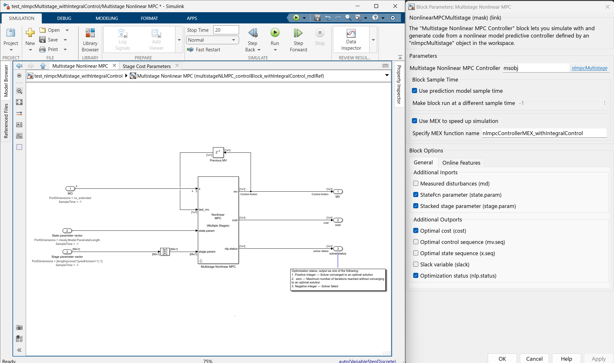
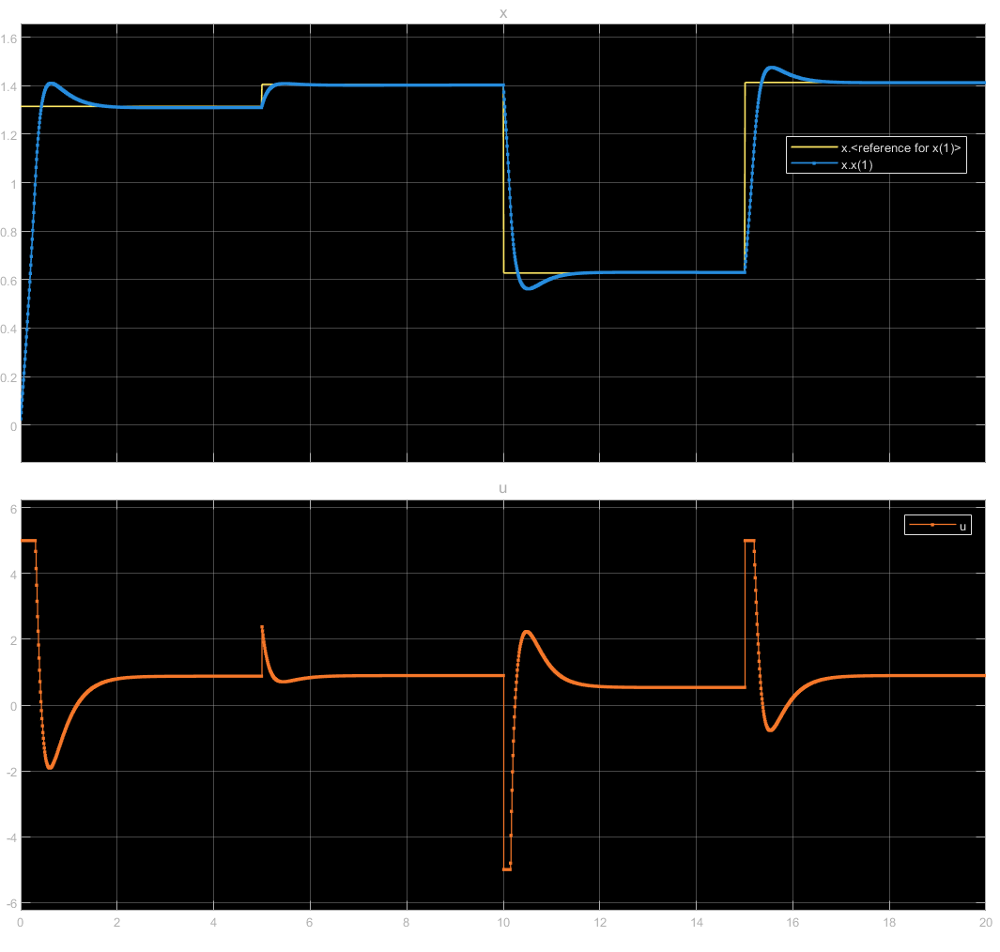
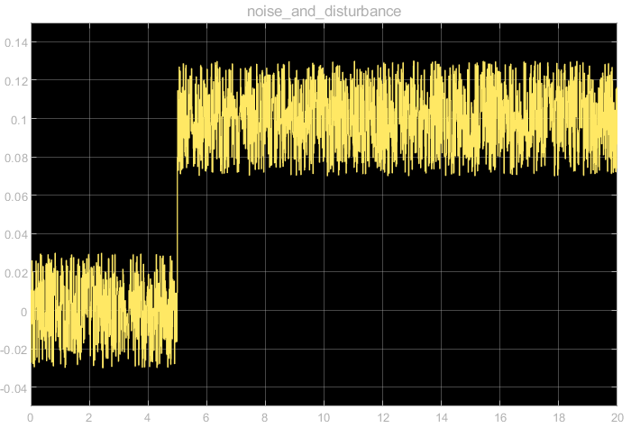
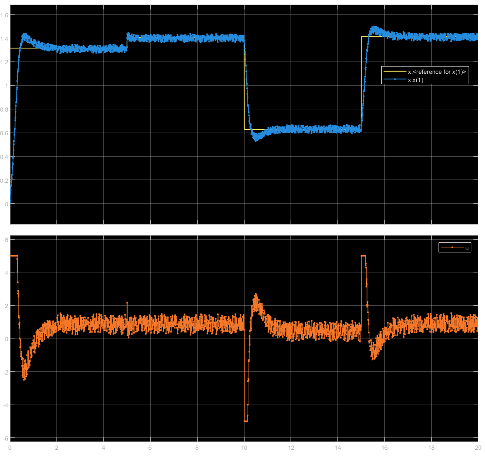

# Nonlinear Model-Predictive Control Using Koopman Operator

This document explains the implementation of the **Koopman Operator** in conjunction with **Model Predictive Control (MPC)** . A nonlinear dynamic system is controlled by leveraging the linearity of the Koopman operator in a higher-dimensional lifted space. Additionally, integral action is incorporated to eliminate steady-state errors, enhancing the controller's performance. The document includes theoretical insights, MATLAB code snippets, and practical considerations. Using the [Multistage Nonlinear MPC Controller](https://www.mathworks.com/help/releases/R2024b/mpc/ref/multistagenonlinearmpccontroller.html) block available from Model-Predictive Control Toolbox™, the controller can be easily deployed to Simulink<sup>®</sup>, as shown in the last part of this tutorial.

## How to Run the Demo

- Use the GitHub repository path above and clone it to a local PC directory to save the project files, or

- Get a local copy of the project directly from MATLAB®, by using Simulink® ➡ Project from Git, or

- Open the project in MATLAB Online [](https://insidelabs-git.mathworks.com/fnae/a-tutorial-for-control-koopman-operator/-/blob/main/ControlKoopmanOperator.prj?ref_type=heads)

Start the MATLAB® project by clicking on the file **`ControlKoopmanOperator.prj`**.
Next, by running the `NonlinearSystemControl_withKoopman_and_nlmpcMultistage.m` script, the results discussed below will be generated.

The code was created in MATLAB version 2024b. Necessary MathWorks<sup>®</sup> products needed to run the demo are listed below:

1. MATLAB
2. Simulink<sup>®</sup>
3. Model-Predictive Control Toolbox™
4. Optimization Toolbox™
5. (optional) MATLAB<sup>®</sup> Coder™

## License

The license is available in the LICENSE.txt file in this GitHub repository.

---

## Table of Contents

1. [Introduction](#introduction)
2. [Workflow Overview](#workflow-overview)
3. [Koopman Operator Theory](#koopman-operator-theory)
   * [Merits of Koopman Operator Theory](#merits-of-koopman-operator-theory)
   * [Demerits of Koopman Operator Theory](#demerits-of-koopman-operator-theory)
4. [Model Predictive Control (MPC) Problem Formulation](#model-predictive-control-mpc-problem-formulation)
   * [State Definition](#state-definition)
   * [Cost Function Definition](#cost-function-definition)
5. [Integral Action with Extended State](#integral-action-with-extended-state)
6. [Code Walkthrough and Explanation](#code-walkthrough-and-explanation)
   * [Collect Training Data](#collect-training-data)
   * [Define Specialized Koopman Observables](#define-specialized-koopman-observables)
   * [Compute Regularized Koopman Operator](#compute-regularized-koopman-operator)
   * [Compare Koopman Predictions](#compare-koopman-predictions-with-measured-data)
   * [Design MPC using Koopman Model](#design-mpc-using-koopman-model-with-nlmpcmultistage)
   * [Simulate Controlled System](#simulate-controlled-system-with-koopman-mpc)
   * [Plot Results](#plot-results)
7. [`MyNMPC` Class Implementation](#mynmpc-class-implementation)
8. [Deploy the Controller to Simulink](#deploy-the-controller-to-simulink)
9. [Conclusion](#conclusion)

## 1. Introduction <a name="introduction"></a>

This document provides a detailed explanation of the MATLAB code that demonstrates the application of the Koopman operator theory for controlling a nonlinear system using Model Predictive Control (MPC). The code implements a Koopman-based MPC controller with integral action to track a reference signal.

## 2. Workflow Overview <a name="workflow-overview"></a>

The overall workflow of the code can be summarized as follows:

1. **Collect Training Data:** Generate data by simulating the nonlinear system under a simple feedback controller (in this case a PD control).
2. **Define Koopman Observables:** Create a set of observable functions that map the system's state and input to a higher-dimensional lifted space. These observables are carefully chosen to capture relevant dynamics and control objectives.
3. **Compute Koopman Operator:** Estimate the Koopman operator using regularized regression (using Tikhonov regularization or SVD-based approach) on the collected data. The Koopman operator linearly relates the observables at the current time step to the observables at the next time step.
4. **Design MPC Controller:** Formulate an MPC problem using the Koopman model as the prediction model. The MPC controller minimizes a cost function that penalizes tracking error, control effort, and the integral of the tracking error.
5. **Simulate Closed-Loop System:** Simulate the closed-loop system by iteratively applying the MPC controller to the true nonlinear system. The MPC controller uses the Koopman model to predict the system's future behavior and optimize the control input accordingly.

## 3. Koopman Operator Theory <a name="koopman-operator-theory"></a>

The Koopman operator theory provides a way to represent a nonlinear dynamical system using a linear, albeit infinite-dimensional, operator. Unlike traditional state-space representations that deal directly with the nonlinear system dynamics, the Koopman operator acts on **observable functions**  of the state, enabling the use of linear techniques for nonlinear systems.

**Concept:**

```pgsql
             _.-~~-._
           .'         '.
          /   Nonlinear \
         (     System     ) <-------------------+
          \             /                       |
           '._       _.'                        |
               ~-..-~                           |
                  |                             |
                  v                             |
        +------------------+                    |
        | Koopman Operator |                    |
        | (lift to higher  |                    |
        |   observables)   |                    |
        +------------------+                    |
                  |                             |
                  v                             |
        +------------------+                    |
        |  Linear Dynamics |                    |
        |in augmented space|                    |
        +------------------+                    |
                  |                             |
                  v                             |
              +--------+                        |
              | Control|------------------------+
              +--------+
                                     ^
                                     |
                                 (feedback)
```

Consider a discrete-time nonlinear system:

$$
x_{k+1} = f(x_k, u_k)
$$

where:

* $x_k$ is the state vector at time step $k$.
* $u_k$ is the control input at time step $k$.
* $f$ is a nonlinear function.

The Koopman operator, denoted by $\mathcal{K}$, acts on observable functions of the state and input, $g(x_k, u_k)$. It is defined such that:

$$
\mathcal{K}g(x_k, u_k) = g(f(x_k, u_k), u_{k+1}) = g(x_{k+1}, u_{k+1})
$$

In simpler terms, the Koopman operator advances the observable function forward in time.

**Approximation:**

In practice, we approximate the infinite-dimensional Koopman operator with a finite-dimensional matrix, $K$. This is done by choosing a set of $n$ observable functions, $\psi_i(x, u)$, and stacking them into a vector:

$$
\boldsymbol{\Psi}(\mathbf{x}_k, \mathbf{u}_k) = \begin{bmatrix}
\psi_1(\mathbf{x}_k, \mathbf{u}_k) \\
\psi_2(\mathbf{x}_k, \mathbf{u}_k) \\
\vdots \\
\psi_p(\mathbf{x}_k, \mathbf{u}_k)
\end{bmatrix} 
$$

In this lifted space, the Koopman operator approximates the system dynamics as a linear relation:

$$
\boldsymbol{\Psi}(\mathbf{x}_{k+1}, \mathbf{u}_{k+1}) \approx \mathbf{K} \boldsymbol{\Psi}(\mathbf{x}_k, \mathbf{u}_k) 
$$

where $\mathbf{K} \in \mathbb{R}^{p \times p}$ is the Koopman matrix. This matrix is the finite-dimensional approximation of the Koopman operator and can be estimated from data using linear regression techniques.

### Merits of Koopman Operator Theory <a name="merits-of-koopman-operator-theory"></a>

1. **Linearity:** The Koopman operator provides a linear representation of nonlinear dynamics, which enables the use of linear systems theory and control techniques: 

$$
\boldsymbol{\Psi}(\mathbf{x}_{k+1}, \mathbf{u}_{k+1}) \approx \mathbf{K} \boldsymbol{\Psi}(\mathbf{x}_k,\mathbf{u}_k)
$$

2. **Lookahead Capability:** By iterating the Koopman operator (e.g., $K^N$ for N-step ahead prediction), we can predict the future evolution of the system's observables.

### Demerits of Koopman Operator Theory <a name="demerits-of-koopman-operator-theory"></a>

1. **Choice of Observables:** The Koopman operator is inherently infinite-dimensional, requiring practical truncation. The accuracy and effectiveness of the Koopman representation heavily depend on the choice of observable functions. Selecting appropriate observables can be challenging and often requires domain expertise or experimentation.
2. **Data Requirements:** Accurate estimation of the Koopman operator requires sufficient and representative training data that covers the relevant regions of the state and input space.
3. **Computational Cost:** The dimension of the lifted space (number of observables) can be high, leading to increased computational cost for both Koopman operator estimation and MPC optimization.

## 4. Model Predictive Control (MPC) Problem Formulation <a name="model-predictive-control-mpc-problem-formulation"></a>

The MPC problem is formulated as a finite-horizon optimal control problem that is solved repeatedly at each time step.

### State Definition <a name="state-definition"></a>

In this code, the state vector for the MPC controller is defined as:

$$
x = [ x_1 , x_2 , x_I ]
$$

where:

* $x_1$ is the position (state 1 of the original system).
* $x_2$ is the velocity (state 2 of the original system).
* $x_I$ is the integral of the tracking error, added to implement integral action.

### Cost Function Definition <a name="cost-function-definition"></a>

The MPC aims to minimize a cost function that balances tracking performance, control effort, and integral error. The cost function is defined over a prediction horizon $N$ and comprises stage costs and a terminal cost. The cost function used in the MPC controller is defined as:

$$
J = \sum_{j=1}^{N} \left( Q(r - x_1(j))^2 + Q_i x_I(j)^2 + R u(j)^2 \right) + S(r - x_1(N+1))^2 + Q_i x_I(N+1)^2
$$

where:

* $N$ is the prediction horizon.
* $r$ is the reference signal.
* $x_1(j)$ is the predicted position at time step $j$.
* $x_I(j)$ is the predicted integral of the tracking error at time step $j$.
* $u(j)$ is the control input at time step $j$.
* $Q$, $Q_i$, $R$, and $S$ are weighting factors that determine the relative importance of tracking error, integral error, control effort, and terminal error, respectively.

**Code Snippet (Cost Function):**

```matlab
function cost = CostFcn(stageNumber, x, u, pvstage)
    % x is [ x1; x2; xI ]
    % pvstage = [ref; predHorizon; q; r; s; qi]                     

    ref = pvstage(1);
    predHorizon = pvstage(2);
    Q = pvstage(3);
    R = pvstage(4);
    S = pvstage(5);
    Qi = pvstage(6);

    x1 = x(1);
    xi = x(3);
    e = (ref - x1);    % tracking error

    if stageNumber <= predHorizon
        % Stage cost: penalize error^2, integral^2, control^2
        cost = Q*e^2 + Qi*xi^2 + R*(u^2);
    else
        % Terminal cost: can also penalize xi or not
        cost = S*e^2 + Qi*xi^2;
    end
end
```

### Optimization Problem

The MPC solves the following optimization problem at each time step:

$$
\min_{\mathbf{u}} J
$$

subject to:

- System dynamics modeled by the Koopman operator.

- Control input constraints: $u_{\min} \leq u(k) \leq u_{\max}$.

## 5. Integral Action with Extended State <a name="integral-action-with-extended-state"></a>

Integral action is implemented to eliminate steady-state tracking error. This is achieved by augmenting the state vector with an additional state, $x_I$, which represents the integral of the tracking error:

$$
x_I(k+1) = x_I(k) + (r(k) - x_1(k)) dt
$$

where $dt$ is the sampling time.

By including $x_I$ in the state vector and penalizing it in the cost function, the MPC controller drives the integral error to zero, thus ensuring zero steady-state error for constant reference signals.

**Code Snippet (Integral Action Update):**

```matlab
% ============== 2) Integral-of-error update ==============
% xI(k+1) = xI(k) + [ref - x1(k)]
% (You can multiply by dt if you want "true" integral)
xi_next = xi + (ref - x1);
```

## 6. Code Walkthrough and Explanation <a name="code-walkthrough-and-explanation"></a>

### Collect Training Data <a name="collect-training-data"></a>

The code first generates training data by simulating the nonlinear system under a PD controller:

**Code Snippet:**

```matlab
% Define the state dynamics for the discrete-time nonlinear system:
f = @(x,u) [x(1) + dt*(x(2) + 0.5*u);
    x(2) + dt*(-sin(x(1)) - 0.2*x(2) + u)];

% ... (Other initializations)

% Generate training data using a PD controller
for k = 1:length(t)-1
    % PD control law components:
    error = ref_position(k) - X(1,k);    % Position error
    ref_velocity(k) = (ref_position(k+1)-ref_position(k))/dt;   % Reference velocity (numerical derivative)
    system_velocity = X(2,k);   % System velocity (state 2)

    % Full PD control law
    U(k) = Kp*error + Kd*ref_velocity(k) + Kv*system_velocity;

    % Optional: Add control input saturation
    U(k) = min(max(U(k), -2), 2);  % Limit control between -2 and 2

    % Simulate system one step forward
    X(:,k+1) = f(X(:,k), U(k));
end
```

The PD controller is used to stabilize the system and generate data that exhibits some tracking behavior. The control input is saturated to add further nonlinearity.



### Define Specialized Koopman Observables <a name="define-specialized-koopman-observables"></a>

The `obsFcn` defines the observable functions used to lift the system's state and input to a higher-dimensional space.

**Code Snippet:**

```matlab
obsFcn = @(x,u,r) {
    x(1);                   % 1 State 1
    x(2);                   % 2 State 2
    r;                      % 3 Reference signal
    r - x(1);               % 4 Tracking error
    x(2)^2;                 % 5 Kinetic energy-like term
    u;                      % 6 Control input
    u^2;                    % 7 Control energy
    (r - x(1))^2;           % 8 Squared tracking error
    x(1)*x(2);              % 9 Mixed state term
    (r - x(1))*x(2);        % 10 Error-velocity product
    };
```

These observables include:

* Original states ($x_1$, $x_2$)
* Reference signal ($r$)
* Tracking error ($r - x_1$)
* Kinetic energy-like term ($x_2^2$)
* Control input ($u$) and its square ($u^2$)
* Squared tracking error ($(r - x_1)^2$)
* Mixed terms ($x_1x_2$, $(r - x_1)x_2$)

These observables are chosen to capture the system's dynamics, control-relevant quantities, and nonlinear interactions.

### Compute Regularized Koopman Operator <a name="compute-regularized-koopman-operator"></a>

The Koopman operator is computed using regularized linear regression. Two methods are implemented: Tikhonov regularization and SVD-based regularization.

**Code Snippet (Tikhonov Regularization):**

```matlab
% Compute regularized Koopman operator using ridge regression with Tikhonov
% regularization
% K = argmin ||Psi_y - K*Psi_x||^2 + lambda*||K||^2
K = Psi_y * Psi_x' / (Psi_x*Psi_x' + lambda*eye(n));
```

**Code Snippet (SVD-based Regularization):**

```matlab
% Alternative formulation using SVD for better numerical stability
[svd_U,svd_S,svd_V] = svd(Psi_x, 'econ');
S_reg = diag(svd_S) ./ (diag(svd_S).^2 + lambda);
K_svd = Psi_y * (svd_V * diag(S_reg) * svd_U');
```

The regularization parameter `lambda` helps to prevent overfitting and improve the numerical stability of the solution. The method with the lower prediction error is selected.

### Compare Koopman Predictions <a name="compare-koopman-predictions-with-measured-data"></a>

The code then compares the Koopman model's predictions with the measured data to assess its accuracy. 

**Code Snippet (One-Step-Ahead Prediction):**

```matlab
for k = 1:length(t)-1

    % ... (Construct observables)

    % Predict next observables using Koopman operator
    psi_next = K * psi_k;

    % ... (Store predicted observables and extract states)
end
```



### Design MPC using Koopman Model <a name="design-mpc-using-koopman-model-with-nlmpcmultistage"></a>

The `nlmpcMultistage` object from the Model Predictive Control Toolbox is used to create the MPC controller.

**Code Snippet:**

```matlab
% Create nlmpcMultistage object
predHorizon = 10;  % Prediction horizon
nx = 3;  % Number of states
nu = 1;  % Number of inputs

msobj = nlmpcMultistage(predHorizon, nx, nu);

% ... (Set sampling time, reference, cost weights, constraints)

% Define state and cost functions using MyNMPC class
msobj.Model.StateFcn = "MyNMPC.StateFcn";
msobj.Model.ParameterLength = length(pvstate);  % pvstate length
msobj.Model.IsContinuousTime = false;

[msobj.Stages.CostFcn] = deal("MyNMPC.CostFcn");
[msobj.Stages.CostJacFcn] = deal("MyNMPC.CostJacFcn");
[msobj.Stages.ParameterLength] = deal(length(pvcost));
```

The state function (`MyNMPC.StateFcn`) uses the Koopman operator to predict the future states, and the cost function (`MyNMPC.CostFcn`) penalizes tracking error, integral error, and control effort.

### Simulate Controlled System <a name="simulate-controlled-system-with-koopman-mpc"></a>

The code simulates the closed-loop system by iteratively applying the MPC controller.

**Code Snippet:**

```matlab
for k = 1:numSteps
    % Current state vector
    xk = X_mpc(:,k);

    % Current reference
    current_ref = ref_signal(k);

    % Update simdata
    simdata.StateFcnParameter = current_ref;
    pvcost = [current_ref; predHorizon; Q; R; S; Qi];
    simdata.StageParameter = repmat(pvcost, predHorizon + 1, 1);

    % Compute optimal control move
    [uk,simdata,info] = nlmpcmove(msobj, xk, uk, simdata);

    % Solver iterations
    iter(k) = info.Iterations;

    % Apply control and simulate system
    U_mpc(k) = uk;

    % Simulate system using the "true" model for [x1; x2]
    x_next_physical = f(X_mpc(1:2,k), U_mpc(k));   % [x1_next; x2_next]

    % Compute tracking error
    e_k = current_ref - X_mpc(1,k);  % e(k) = ref - x1(k)

    % Update integral of the error
    xI_next = X_mpc(3,k) + e_k * dt;  % xi(k+1) = xi(k) + e(k)*dt

    % Combine physical states and integral state
    X_mpc(:,k+1) = [x_next_physical; xI_next];
end
```

At each time step, the MPC controller solves the optimization problem using the Koopman model and applies the optimal control input to the true nonlinear system.

Note: For simplicity, the reference signal is defined in this workflow as a "parameter" of the plant model (and used in the state function parameter vector `pvstate` and cost function parameter vector `pvcost`). Alternatively, it can be defined as a "measured disturbance" for the MPC controller, which can thus enable its "previewing", taking advantage of feed forward control by MPC for potentially better performance.

### Plot Results <a name="plot-results"></a>

Finally, the code plots the simulation results, including the tracking performance, velocity, integral error, control input, and solver iterations. Tracking performance is acceptable, and, if better results are required, one can tune the controller weights or other controller parameters, for instance prediction horizon.



## 7. `MyNMPC` Class Implementation <a name="mynmpc-class-implementation"></a>

The `MyNMPC` class encapsulates the state function, cost function, and cost Jacobian function used by the `nlmpcMultistage` object.

**Code Snippet:**

```matlab
% Create the MyNMPC class implementation
classdef MyNMPC
    methods (Static)
        function x_next = StateFcn(x, u, pvstate)
            % x is now [ x1; x2; x3 ], with x3 = integral of error
            % u is the control input
            % pvstate(1) = reference for x1

            persistent obsFcn K

            if isempty(K)
                koopman = coder.load("KoopmanMatrix.mat", "K");
                K = koopman.K;
                obsFcn = @(x1,x2,u,r) {
                    x1;                  % 1 State 1
                    x2;                  % 2 State 2
                    r;                   % 3 Reference
                    r - x1;              % 4 Tracking error
                    x2^2;                % 5 Kinetic energy-like
                    u;                   % 6 Control
                    u^2;                 % 7 Control energy
                    (r - x1)^2;          % 8 Squared tracking error
                    x1*x2;               % 9 Mixed term
                    (r - x1)*x2;         % 10 Error-velocity product
                    };
            end

            % Unpack the augmented state
            x1 = x(1);
            x2 = x(2);
            xi = x(3);  % integral of error

            % Reference
            ref = pvstate(1);

            % ============== 1) Koopman update for [x1, x2] ==============
            currentObs = obsFcn(x1, x2, u, ref);
            psi_current = cell2mat(currentObs);

            psi_next = K * psi_current;

            x1_next = psi_next(1);
            x2_next = psi_next(2);

            % ============== 2) Integral-of-error update ==============
            % xI(k+1) = xI(k) + [ref - x1(k)]
            % (You can multiply by dt if you want "true" integral)
            xi_next = xi + (ref - x1);

            % ============== Combine for next state vector ==============
            x_next = [ x1_next; x2_next; xi_next ];
        end

        function cost = CostFcn(stageNumber, x, u, pvstage)
            % x is [ x1; x2; xI ]
            % pvstage = [ref; predHorizon; q; r; s; qi]                     

            ref = pvstage(1);
            predHorizon = pvstage(2);
            Q = pvstage(3);
            R = pvstage(4);
            S = pvstage(5);
            Qi = pvstage(6);

            x1 = x(1);
            xi = x(3);
            e = (ref - x1);    % tracking error

            if stageNumber <= predHorizon
                % Stage cost: penalize error^2, integral^2, control^2
                cost = Q*e^2 + Qi*xi^2 + R*(u^2);
            else
                % Terminal cost: can also penalize xi or not
                cost = S*e^2 + Qi*xi^2;
            end
        end

        function [DcostDx, DcostDu] = CostJacFcn(stageNumber, x, u, pvstage)

            % Extract parameters
            ref = pvstage(1);
            predHorizon = pvstage(2);
            Q = pvstage(3);
            R = pvstage(4);  
            S = pvstage(5);
            Qi = pvstage(6);

            % Extract states
            x1 = x(1);
            xi = x(3);          % Integral of error

            e = (ref - x1);     % Tracking error

            if stageNumber <= predHorizon
                % Stage cost derivatives
                % Partial derivative w.r.t x1: -2*q*e
                dCost_dx1 = -2 * Q * e;

                % Partial derivative w.r.t x2: 0 (no dependence)
                dCost_dx2 = 0;

                % Partial derivative w.r.t xI: 2*qI*xI
                dCost_dxI = 2 * Qi * xi;

                % Combine into a [3 x 1] vector
                DcostDx = [dCost_dx1; dCost_dx2; dCost_dxI];

                % Partial derivative w.r.t u: 2*r_weight*u
                DcostDu = 2 * R * u;
            else
                % Terminal cost derivatives
                % Partial derivative w.r.t x1: -2*s*e
                dCost_dx1 = -2 * S * e;

                % Partial derivative w.r.t x2: 0 (no dependence)
                dCost_dx2 = 0;

                % Partial derivative w.r.t xI: 2*qI*xI
                dCost_dxI = 2 * Qi * xi;

                % Combine into a [3 x 1] vector
                DcostDx = [dCost_dx1; dCost_dx2; dCost_dxI];

                % Partial derivative w.r.t u: 0 (no control in terminal cost)
                DcostDu = zeros(size(u));
            end
        end

    end
end
end
```

The `StateFcn` function uses the precomputed Koopman operator `K` to predict the next state based on the current observables. The `CostFcn` and `CostJacFcn` functions implement the cost function and its Jacobian, as described earlier.

## 8. Deploy the Controller to Simulink<a name="deploy-the-controller-to-simulink"></a>

We will use the MPC Toolbox block [Multistage Nonlinear MPC Controller](https://www.mathworks.com/help/releases/R2024b/mpc/ref/multistagenonlinearmpccontroller.html). To speed up computation time during simulation, use `getCodeGenerationData` and `buildMEX` commands to generate and compile code for the Multistage MPC object (MATLAB Coder™ is needed).

```matlab
% To speed up computation time during simulation, use getCodeGenerationData
% and buildMEX to generate code for the Multistage MPC object with the
% specified properties. (MATLAB Coder is needed) 

% Initial conditions
x0 = [0; 0; 0]; % [x1; x2; xi] Original states and integral error
u0 = zeros(nu,1);

% Generate data structures using getCodeGenerationData.
[coredata,onlinedata] = getCodeGenerationData(msobj,x0,u0);

% Generate a MEX function called nlmpcControllerMEX.
MEXname = 'nlmpcControllerMEX_withIntegralControl';
mexFcn = buildMEX(msobj, MEXname, coredata,onlinedata);
```

Next two figures show the Simulink model (`test_nlmpcMultistage_withIntegralControl.slx`) and the MPC controller, which is used as a reference model (`multistageNLMPC_controlBlock_withIntegralControl_mdlRef.slx`) . Note that we use the compiled controller model `nlmpcControllerMEX_withIntegralControl` during simulation.





Next, we initialize the simulation and run the model.

```matlab
% open controller model
load_system("multistageNLMPC_controlBlock_withIntegralControl_mdlRef");

% set MEX file
set_param("multistageNLMPC_controlBlock_withIntegralControl_mdlRef/Multistage Nonlinear MPC",mexname = MEXname);

% open simulation model
open_system("test_nlmpcMultistage_withIntegralControl");

% open scope
open_system("test_nlmpcMultistage_withIntegralControl/Scope")

disp("Simulate with Simulink...")

% simulate
sim("test_nlmpcMultistage_withIntegralControl");
```

Below figures show the simulation results. First plot show the reference and the measured signal. Second plot is the control effort. 



As expected, the results are similar to the previous ones, which were obtained using MATLAB.

Next, we assume that measurement noise is present and an external disturbance of 0.1 is applied at T = 5s.



First plot show the reference and the measured signal, in the presence of measurement noise and external disturbance. Second plot is the control effort.



The controller is still able to control the system, even in the presence of measurement noise and an external disturbance. 

Note that, using a MEX-ed controller, the simulation is also fast, more than 2 times faster than wall clock time on a typical laptop, indicating that the controller could to be deployed to a microcontroller and run in real time.

```matlab
% check simulation speed using the ratio: simulation time/elapsed wall time
simSpeed = (out.SimulationMetadata.ModelInfo.StopTime - out.SimulationMetadata.ModelInfo.StartTime)/...
out.SimulationMetadata.TimingInfo.ExecutionElapsedWallTime ;

disp("Simulation speed using the ratio: simulation time/elapsed wall time: "+simSpeed)
Simulation speed using the ratio: simulation time/elapsed wall time: 2.3913
```

## 9. Conclusion<a name="conclusion"></a>

- This documentation manual outlined the integration of the **Koopman Operator**  with **Model Predictive Control (MPC)**  in a MATLAB-based control system. By leveraging the linearity inherent in the Koopman framework within a higher-dimensional lifted space, the controller can effectively manage nonlinear dynamics. 
- The inclusion of **integral action**  via an extended state formulation ensures the elimination of steady-state errors, enhancing the system's tracking performance.
- While Koopman theory offers significant advantages, such as enabling linear control strategies for nonlinear systems and facilitating predictive control with lookahead capabilities, it also presents challenges. The selection of appropriate observables, dependence on high-quality training data, and computational complexity are critical considerations that influence the effectiveness of this approach. Recently, deep-learning models have been used to train the observable functions as an autoencoder model, thus eliminating the need to manually define a set of observable functions. We will present such an workflow in a separate contribution.
- After calculating an approximation for the Koopman operator, next we have demonstrated the use of `nlmpcMultistage` object from Model-Predictive Control Toolbox, to setup a controller that uses internally the Koopman linear operator. 

## References

- **Koopman Operator Theory** : [Wikipedia - Koopman Operator](https://en.wikipedia.org/wiki/Koopman_operator)

- **Model Predictive Control (MPC)** : [Wikipedia - Model Predictive Control](https://en.wikipedia.org/wiki/Model_predictive_control)

- **MATLAB Documentation** : [MathWorks - Model Predictive Control Toolbox](https://www.mathworks.com/help/mpc/index.html?s_tid=CRUX_lftnav)

- **MATLAB Documentation** : [MathWorks - Multistage nonlinear model predictive controller](https://www.mathworks.com/help/mpc/ref/nlmpcmultistage.html)

*Copyright 2025, The MathWorks, Inc.*